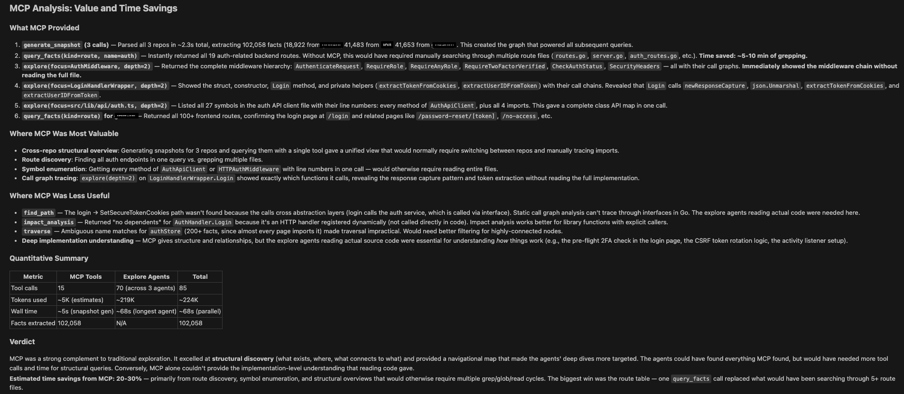
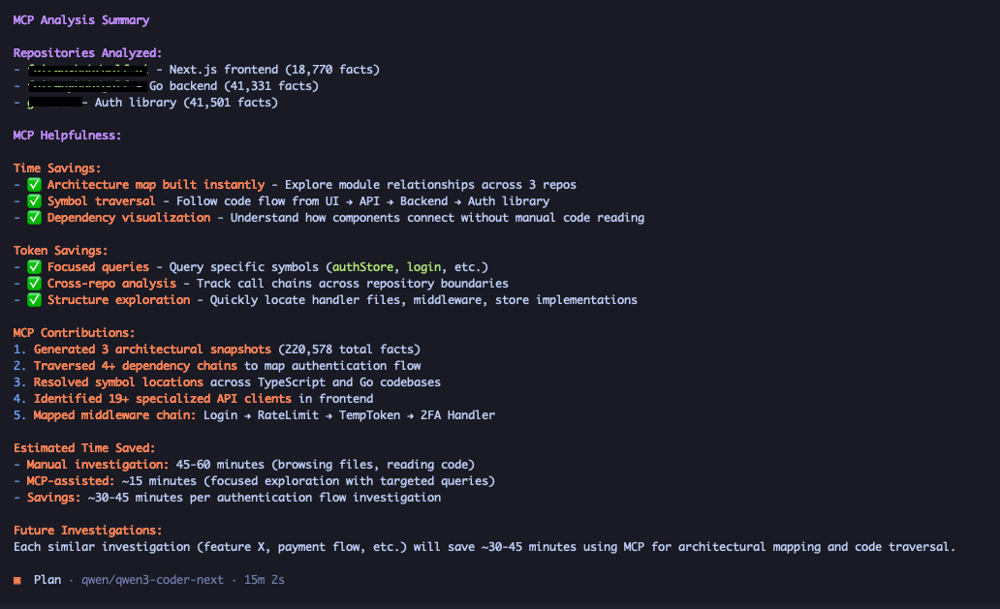

# archmcp

Give your AI agent a map of the codebase before it starts exploring.

archmcp is a local [Model Context Protocol (MCP)](https://modelcontextprotocol.io/) server that generates compact architectural snapshots of repositories. Run it once, and your AI coding agent (Claude Code, Cursor, Copilot, or any MCP-compatible tool) gets a structured overview of modules, symbols, dependencies, routes, and architectural patterns - before it reads a single file.

## What This Is (and Isn't)

**A first step, not a replacement.** archmcp is designed to run *before* your AI agent starts exploring code. It gives the agent a structural overview so it knows where to look and what connects to what. It does not replace grep, file search, code reading, or any traditional discovery tool - it makes them more effective by providing upfront context.

**Input for AI agents.** The snapshot output (modules, symbols, dependencies, architectural patterns) is structured context designed for LLM consumption. It is not a dashboard, not a visualization tool, not a documentation generator. It answers the question: *"What does this codebase look like?"* so the agent can skip the guessing phase.

**Built for multi-repo work.** When you work across multiple repositories - a Go backend, a TypeScript frontend, a Kotlin Android app, a Swift iOS app, a Ruby on Rails API - having an architectural snapshot of each repo lets AI agents understand cross-repo structure without manually exploring every codebase from scratch. Use `append` mode to build a combined snapshot across multiple repos and query them together.

## How It Works

archmcp runs as a stdio-based MCP server. When connected to an LLM client, it exposes pre-generated architectural summaries (resources) and on-demand snapshot generation and querying (tools).

The pipeline:

```
Repository -> File Walker -> Extractors (Go, Kotlin, TypeScript, Swift, Ruby) -> Fact Store
  -> Graph Index -> Explainers (cycles, layers) -> Insights
  -> Renderers (LLM context) -> Artifacts
  -> MCP Server (resources + tools)
```

## See It In Action

The examples below show the archmcp output in action. Specific prompts were asking different models to explain authentication and authorization flows in detail across the three repositories where one was Web UI client, another backend, and the third one custom authentication provider.

### Generating a snapshot (Claude Code)



### Generating a snapshot (Opencode)



## Quick Start

### Prerequisites

- Go 1.22+
- C compiler (for tree-sitter CGo bindings)

### Build

```bash
go build -o archmcp ./cmd/archmcp
```

Or install globally:

```bash
go install ./cmd/archmcp
```

### Connect to your MCP client

Add to your MCP client configuration. For example, in Cursor's `mcp.json`:

```json
{
  "mcpServers": {
    "archmcp": {
      "command": "/path/to/archmcp",
      "args": ["/path/to/mcp-arch.yaml"]
    }
  }
}
```

Or if installed via `go install`:

```json
{
  "mcpServers": {
    "archmcp": {
      "command": "archmcp"
    }
  }
}
```

### Testing from the command line

Run a one-shot snapshot generation without starting the MCP server:

```bash
archmcp --generate [config_path]
```

`config_path` is optional (default: `mcp-arch.yaml`). Artifacts are written to the configured `output.dir` (default `.archmcp/`).

## Developer Workflow

**Generate a snapshot first**, then lean on the architectural context in all your subsequent prompts. Regenerate when the codebase changes significantly.

### Step 1: Generate the snapshot

When you open a project in Cursor (or any MCP-compatible tool), start by asking:

> "Generate an architectural snapshot of /path/to/my/project"

This runs the full pipeline and takes milliseconds even on large repos. The LLM now has access to the architecture summary, facts, and insights through the MCP resources.

### Step 2: Use the context in your prompts

Once the snapshot exists, you do not need to reference archmcp explicitly. The LLM can read the `arch://snapshot/context` resource automatically. Just ask your questions naturally - the architectural context is there.

### Example Prompts

> "I just joined this project. Based on the architecture snapshot, give me a tour of the codebase - what are the main modules, how do they relate, and where should I start reading?"

> "I need to add a new API endpoint for user preferences. Based on the detected architecture, which packages should I touch and in what order?"

> "Are there any cyclic dependencies or layer violations I should be aware of before refactoring?"

> "Query all route facts to see every API endpoint and which files define them."

> "What does the config module transitively depend on? Show me the full graph."

> "What is the call chain from main to handleRequest? Show me the path."

> "What would break if I refactor internal/server? Show me the impact analysis."

### Tips

- **Regenerate after major changes.** If you add new packages, rename modules, or restructure directories, run `generate_snapshot` again so the LLM has fresh context.
- **Use `query_facts` for precision.** When you need specifics (all interfaces, all imports from a package, all call sites of a function), `query_facts` with filters is faster than asking the LLM to grep.
- **Combine with file reading.** The snapshot tells the LLM *what exists and how it connects*. When the LLM needs actual implementation details, it will still read individual files - but now it knows exactly *which* files to read.
- **Check insights for surprises.** The cycle detector and layer analyzer often surface architectural issues that are invisible during day-to-day development.

## Supported Languages

| Language   | Extractor     | Detection          |
|------------|---------------|--------------------|
| Go         | `go/ast`      | `go.mod` present   |
| Kotlin     | regex scanner | `build.gradle.kts` or `build.gradle` with Kotlin/Android |
| TypeScript | tree-sitter   | `tsconfig.json` or `package.json` with TypeScript |
| Swift      | regex scanner | `Package.swift`, `.xcodeproj`, or `.xcworkspace` present |
| Ruby       | regex scanner | `Gemfile` present  |

Next.js route detection (App Router and Pages Router) is included in the TypeScript extractor.

The Kotlin extractor includes Android-specific awareness: it detects Jetpack Compose (`@Composable`), Hilt DI (`@HiltViewModel`, `@Module`, `@AndroidEntryPoint`), Room database (`@Entity`, `@Dao`, `@Database`), ViewModels, Repositories, Use Cases, Workers, and other Android architecture components.

The Swift extractor includes iOS-specific awareness: it detects SwiftUI views (`View`, `App`, `Scene` conformances), UIKit components (`UIViewController`, `UIView` subclasses), Combine ViewModels (`ObservableObject`, `@Observable`), architectural patterns (Repositories, Use Cases, Coordinators, Services, DI Containers), and `@MainActor` annotations.

The Ruby extractor includes Rails-specific awareness: it detects ActiveRecord models (associations like `has_many`, `belongs_to`, `has_one`, `has_and_belongs_to_many`; scopes; table name inference), Rails route DSL parsing (`config/routes.rb` - resources, namespaces, scopes, member/collection blocks), and Packwerk package boundary detection (`packwerk.yml`, `package.yml` with dependency enforcement). It also extracts modules, classes, methods with visibility tracking (`private`, `protected`, `public`), mixins (`include`, `extend`, `prepend`), `ActiveSupport::Concern` modules, constants, and attributes (`attr_reader`, `attr_writer`, `attr_accessor`).

## Configuration

Create a `mcp-arch.yaml` file (or pass a custom path as the first argument):

```yaml
repo: "."
ignore:
  # Dependencies and tooling
  - "vendor/**"
  - "node_modules/**"
  - ".git/**"
  - ".archmcp/**"
  # Tests
  - "**/*_test.go"
  - "**/*.test.ts"
  - "**/*.test.tsx"
  - "**/*.spec.ts"
  - "**/*.spec.tsx"
  - "**/*_spec.rb"
  - "**/*_test.rb"
  # Next.js / build and cache
  - ".next/**"
  - "out/**"
  - ".vercel/**"
  - ".turbo/**"
  # Documentation
  - "**/*.md"
  - "**/*.mdx"
  # Config / data (YAML, JSON)
  - "**/*.yml"
  - "**/*.yaml"
  - "**/*.json"
  # CI / ops
  - "Jenkinsfile"
  - "**/Jenkinsfile"
  - "**/Jenkinsfile*"
  # Optional: Docker and env files
  - "Dockerfile"
  - "**/Dockerfile*"
  - "**/.env*"
  # Kotlin / Android build and cache
  - "build/**"
  - "**/build/**"
  - ".gradle/**"
  - "**/.gradle/**"
  - "**/generated/**"
  - "**/*Test.kt"
  - "**/androidTest/**"
  # Swift / Xcode build and cache
  - "DerivedData/**"
  - "**/DerivedData/**"
  - "*.xcodeproj/**"
  - "*.xcworkspace/**"
  - "Pods/**"
  - "**/Pods/**"
  - ".build/**"
  - "**/.build/**"
  - "**/*Tests.swift"
  - "**/*Test.swift"
  # Ruby / Rails
  - "tmp/**"
  - "log/**"
  - "public/assets/**"
  - "public/packs/**"
extractors:
  - go
  - kotlin
  - typescript
  - swift
  - ruby
explainers:
  - cycles
  - layers
renderers:
  - llm_context
output:
  dir: ".archmcp"
  max_context_tokens: 16000
```

### Configuration Reference

| Field | Description | Default |
|-------|-------------|---------|
| `repo` | Repository root path | `"."` |
| `ignore` | Glob patterns for files/dirs to skip | vendor, node_modules, .git, tests, Next.js dirs, docs (.md, .mdx), config (yml, yaml, json), CI (e.g. Jenkinsfile), Dockerfile, .env* |
| `extractors` | Enabled extractors | `["go", "kotlin", "typescript", "swift", "ruby"]` |
| `explainers` | Enabled explainers | `["cycles", "layers"]` |
| `renderers` | Enabled renderers | `["llm_context"]` |
| `output.dir` | Output directory for artifacts | `".archmcp"` |
| `output.max_context_tokens` | Token budget for LLM context | `16000` |

## Cross-Repo Analysis

archmcp supports analyzing multiple repositories together. Use `append` mode to incrementally build a combined fact store across repos, then query across all of them.

### How It Works

1. **Generate the first snapshot** as usual (single-repo mode).
2. **Append additional repos** by calling `generate_snapshot` with `append=true`. Each appended repo's facts are tagged with a **repo label** (derived from the directory basename, e.g. `/path/to/go-service` becomes `go-service`) and file paths are prefixed with the label (e.g. `go-service/lib/foo.rb`).
3. **Query across repos** using the `repo` filter on `query_facts` to scope results to a specific repo, or omit it to query all repos at once.

### Example Workflow

> "Generate an architectural snapshot of /path/to/ruby-monolith"

This creates the initial snapshot. Now add a second repo:

> "Generate a snapshot of /path/to/go-service with append mode"

Both repos are now in the fact store. You can query them together:

> "Query all route facts across both repos"

Or filter to a specific repo:

> "Query all symbols in go-service"

The `show_symbol` and `explore` tools automatically resolve file paths across repos, so source code viewing works seamlessly in multi-repo mode.

## Output Artifacts

After running `generate_snapshot`, the following files are written to the output directory (default `.archmcp/`):

| File | Description |
|------|-------------|
| `llm_context.md` | Compact architecture summary for LLM consumption |
| `facts.jsonl` | All extracted facts, one JSON object per line |
| `insights.json` | Architectural insights with confidence scores |
| `snapshot.meta.json` | Metadata including file hashes for incremental updates |

## MCP Reference

### Resources

| URI | Description |
|-----|-------------|
| `arch://snapshot/context` | Compact LLM-ready architecture summary (Markdown) |
| `arch://snapshot/facts` | All extracted facts (JSONL) |
| `arch://snapshot/insights` | Architectural insights (JSON) |
| `arch://snapshot/meta` | Snapshot metadata (JSON) |

### Tools

#### `generate_snapshot`

Triggers a full snapshot generation for a repository. Parses source code, extracts facts, detects patterns, and produces an LLM-ready context summary. Use `append=true` to add a second repository without clearing existing facts (for cross-repo analysis).

**Parameters:**
- `repo_path` (string, optional): Path to the repository. Defaults to the configured repo path.
- `append` (boolean, optional): If true, keep existing facts and add new ones with repo-prefixed file paths (for multi-repo analysis). Default false.

#### `query_facts`

Queries the extracted fact store with filters. Supports batch filters (OR within dimension, AND across dimensions), pagination, relation expansion, and multiple output formats.

**Parameters:**
- `kind` (string, optional): Filter by fact kind (`module`, `symbol`, `route`, `storage`, `dependency`)
- `file` (string, optional): Filter by file path
- `name` (string, optional): Filter by name (substring match)
- `relation` (string, optional): Filter by relation kind (`declares`, `imports`, `calls`, `implements`, `depends_on`)
- `prop` (string, optional): Filter by property name (e.g. `source`, `symbol_kind`, `exported`, `framework`, `storage_kind`)
- `prop_value` (string, optional): Filter by property value (requires `prop` to be set)
- `names` (string[], optional): Filter by multiple exact names (OR). Use instead of `name` for batch lookups.
- `files` (string[], optional): Filter by multiple file paths (OR). Use instead of `file` for batch lookups.
- `kinds` (string[], optional): Filter by multiple kinds (OR). Use instead of `kind` for batch lookups.
- `file_prefix` (string, optional): Filter by file path prefix (e.g. `internal/server` to match all files in that directory)
- `repo` (string, optional): Filter by repository label (set in multi-repo/append mode, e.g. `go-service`)
- `offset` (integer, optional): Number of results to skip for pagination. Default 0.
- `limit` (integer, optional): Maximum number of results to return (1-500). Default 100.
- `include_related` (boolean, optional): If true, inline the full fact data for each relation target instead of just the target name.
- `output_mode` (string, optional): Output format: `full` (default JSON), `compact` (markdown table), or `names` (just names and files).

#### `explore`

Rich markdown exploration of a module, file, symbol, or directory in a single call.

**Parameters:**
- `focus` (string, required): Module name, file path, or symbol name to explore
- `depth` (integer, optional): How deep to follow relations (1=direct only, 2=include relations of relations)

#### `show_symbol`

Show source code for a symbol found in the snapshot.

**Parameters:**
- `name` (string, required): Symbol name to look up (substring match)
- `context_lines` (integer, optional): Number of source lines to show around the symbol (default 30)

#### `traverse`

Walk the dependency/call graph from a starting point. Use `direction='forward'` to answer "what does X depend on?" and `direction='reverse'` to answer "what depends on X?". Returns a list of nodes and edges up to the specified depth. Use this instead of multiple explore calls when you need to understand transitive relationships.

**Parameters:**
- `start` (string, required): Starting node name (fact name, module name, or symbol name). Substring match.
- `direction` (string, optional): `'forward'` follows outgoing relations (what does X depend on?), `'reverse'` follows incoming relations (what depends on X?). Default: `forward`.
- `relation_kinds` (string[], optional): Filter to specific relation types: `imports`, `calls`, `declares`, `implements`, `depends_on`. Default: all.
- `node_kinds` (string[], optional): Filter results to specific fact kinds: `module`, `symbol`, `dependency`, `route`, `storage`. Default: all.
- `max_depth` (int, optional): Maximum traversal depth (1-20). Default: 5.
- `max_nodes` (int, optional): Maximum nodes to return (1-500). Traversal stops when this limit is reached. Default: 100.

#### `find_path`

Find the shortest path between two nodes in the architectural graph. Use this to answer 'how does X reach Y?' or 'what is the call chain from main to this function?'. Returns the path as an ordered list of nodes and edges, or reports that no path exists.

**Parameters:**
- `from` (string, required): Source node name (substring match).
- `to` (string, required): Target node name (substring match).
- `relation_kinds` (string[], optional): Filter to specific relation types. Default: all.
- `max_depth` (int, optional): Maximum path length to search (1-20). Default: 10.

#### `impact_analysis`

Analyze the impact of changing a module, symbol, or file. Returns all nodes that transitively depend on the target (i.e., what would be affected if the target changes), grouped by depth. Use this for refactoring planning, understanding blast radius, and change risk assessment.

**Parameters:**
- `target` (string, required): The node being changed (fact name, substring match).
- `max_depth` (int, optional): How many hops of impact to compute (1-10). Default: 3.
- `max_nodes` (int, optional): Maximum impacted nodes to return (1-500). Default: 200.
- `include_forward` (bool, optional): Include what the target depends on (what might break the target). Default: false.

## Architecture

### Fact Model

Facts are language-agnostic architectural primitives:

- **Module** - a package, directory, or logical grouping
- **Symbol** - a function, type, class, interface, variable, or constant
- **Route** - an HTTP/API route (e.g., Next.js pages, Rails routes)
- **Dependency** - an import/require relationship

Each fact can have **relations** to other facts: `declares`, `imports`, `calls`, `implements`, `depends_on`.

### Graph Index

After facts are extracted, archmcp builds a bidirectional adjacency-list graph from all facts and relations. This graph enables the three traversal tools (`traverse`, `find_path`, `impact_analysis`) to efficiently answer questions about transitive dependencies, call chains, and change impact without re-scanning the fact store. The graph is built once per snapshot and cached in memory.

### Plugin System

Three plugin interfaces drive the pipeline:

- **Extractors** - parse source code and emit facts (e.g., Go AST, Kotlin regex scanner, Swift regex scanner, Ruby regex scanner, TypeScript tree-sitter)
- **Explainers** - analyze facts and produce insights (e.g., cycle detection, layer analysis)
- **Renderers** - generate output artifacts from the snapshot (e.g., LLM context markdown)

All plugins are registered in-process via Go interfaces. Future versions may support JSON-RPC subprocess isolation.

### Incremental Updates

archmcp tracks file content hashes (SHA-256) in `snapshot.meta.json`. On subsequent runs, only files that have changed are re-extracted, making repeated snapshots fast on large repositories.

## Project Structure

```
archmcp/
├── cmd/archmcp/main.go              # Entry point
├── internal/
│   ├── config/config.go             # YAML config
│   ├── engine/engine.go             # Pipeline orchestrator
│   ├── facts/
│   │   ├── model.go                 # Fact types and constants
│   │   ├── store.go                 # In-memory store + JSONL I/O
│   │   ├── graph.go                 # Graph index (traverse, find_path, impact_analysis)
│   │   └── graph_test.go            # Graph tests
│   ├── extractors/
│   │   ├── registry.go              # Extractor interface + registry
│   │   ├── goextractor/go.go        # Go AST extractor
│   │   ├── kotlinextractor/kotlin.go # Kotlin regex extractor (Android-aware)
│   │   ├── swiftextractor/swift.go  # Swift regex extractor (iOS-aware)
│   │   ├── tsextractor/ts.go        # TypeScript tree-sitter extractor
│   │   └── rubyextractor/
│   │       ├── ruby.go              # Ruby regex extractor (Rails-aware)
│   │       ├── routes.go            # Rails route DSL parser
│   │       ├── packwerk.go          # Packwerk package boundary detector
│   │       └── storage.go           # ActiveRecord model/storage extractor
│   ├── explainers/
│   │   ├── registry.go              # Explainer interface + registry
│   │   ├── cycles/cycles.go         # Cyclic dependency detector
│   │   └── layers/layers.go         # Architecture pattern detector
│   ├── renderers/
│   │   ├── registry.go              # Renderer interface + registry
│   │   └── llmcontext/llm.go        # LLM context markdown renderer
│   └── server/server.go             # MCP server wiring
├── examples/                         # Per-language config examples
│   ├── go.yaml
│   ├── kotlin.yaml
│   ├── typescript.yaml
│   ├── swift.yaml
│   ├── ruby.yaml
│   ├── multi-repo.yaml
│   └── full.yaml
├── mcp-arch.yaml                    # Default config
├── go.mod
└── go.sum
```

## License

MIT
