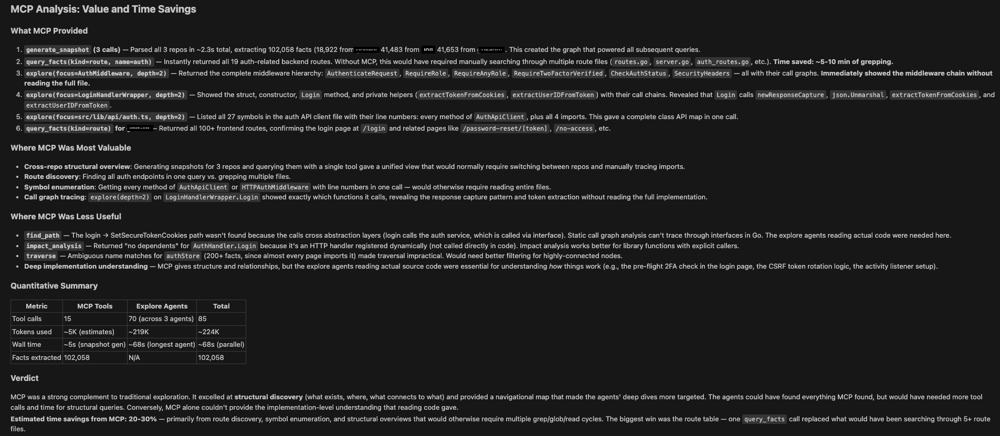
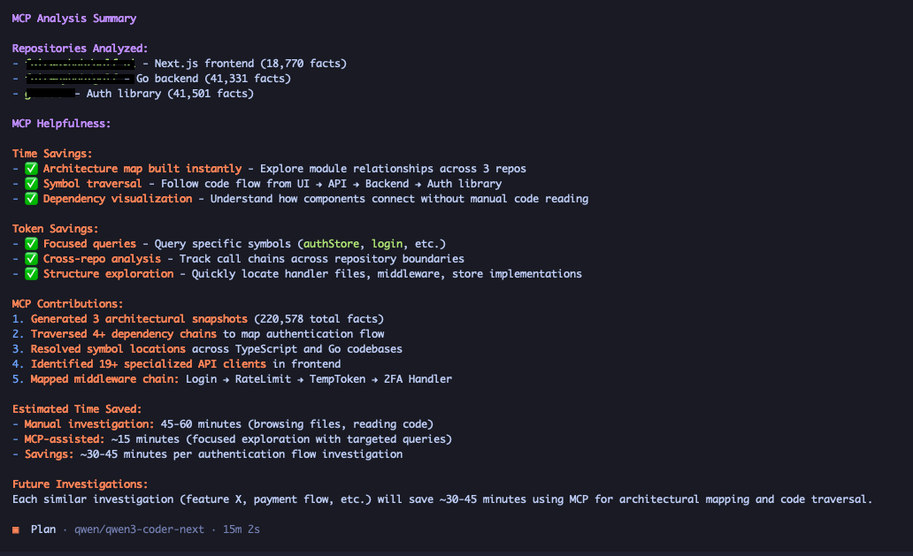

# enola

**A deterministic structural model of your codebase for AI coding agents — your real architecture, extracted from source, not guessed.**

enola is a local [Model Context Protocol (MCP)](https://modelcontextprotocol.io/) server. Point it at one or more repositories and it builds a precise graph of your code's architecture — modules, types, routes, dependencies, and how they all connect — straight from your source. It then exposes tools your AI agent can use to read, traverse, query, and reason over that structure. So before your agent writes a line of code, it already knows the shape of the thing it's editing.

---

## TL;DR — try it in 30 seconds

**1. Install**

```bash
curl -fsSL https://raw.githubusercontent.com/enola-labs/enola/main/install.sh | sh
export PATH="$HOME/.local/bin:$PATH"   # if not already on PATH
```

**2. Connect to your agent**

Claude Code:
```bash
claude mcp add enola enola
```

Cursor (add to `mcp.json`):
```json
{
  "mcpServers": {
    "enola": { "command": "enola" }
  }
}
```

**3. Ask it to map your project**

> "Generate an architectural snapshot of /path/to/my/project"

Done. Your agent now has a precise structural map of your code. For configuration options, multi-repo setup, and what to ask next, see [Quick start](#quick-start) below.

**Supported languages:** Go · JavaScript · TypeScript · Python · Java · Kotlin · Swift · Ruby · C · C++ · PHP · Vue · Svelte · OpenAPI · gRPC — with framework awareness (Next.js, Nuxt, SvelteKit, FastAPI, Django, Spring, Rails, Laravel, Symfony, SwiftUI, Jetpack Compose, WordPress, …)

---

## Why enola

AI coding agents are powerful, but they're non-deterministic. On every task they re-discover your codebase from scratch — grepping, opening files, inferring how things fit together — and they get it subtly wrong often enough to matter. That guessing costs you **time** (wrong turns, re-prompts) and **tokens** (re-reading the same files, every session).

enola removes the guessing from the part that should never be guessed: the structure.

It gives your agent a **deterministic structural model** — a structural architecture graph of your code's real types and relationships, built by parsers and graph algorithms, not by a language model. The structure is *extracted* from your source, not *summarized* from it; these are facts, not notes. Run it twice on the same commit and you get the same answer, every run. The agent starts from facts instead of assumptions.

The result is the difference between *vibe coding* — prompt, hope, fix — and **AI-augmented engineering**: fewer wrong turns, fewer tokens burned, and work you can reproduce. enola adds determinism where AI lacks it, and your agent spends its intelligence on the actual problem instead of re-learning your repo.

> enola is a **first step**, not a replacement. It runs *before* your agent explores, so it knows where to look and what connects to what. It doesn't replace grep, file reading, or code search — it makes them precise.

---

## What it is

Under the hood, enola models your codebase as a **graph of architectural types — which we call _kinds_ — and the relations between them.** That's the whole concept: not a magic "knowledge graph," just a deeply technical, structural model of what your code actually contains.

The **kinds** (the nodes):

- **module** — a package or directory
- **symbol** — a function, method, struct, interface, type, class, or constant
- **route** — an HTTP/API endpoint
- **storage** — a database table or data store
- **dependency** — an import relationship
- **service** — a whole repository (used when you analyze several at once)

The **relations** (the edges) connect them: *declares*, *imports*, *calls*, *implements*, *depends_on*, and more. Because the edges are typed and directed, the graph is *queryable*, not merely searchable — you compute over it. On top of it, enola builds a small set of tools your agent can call to answer real structural questions with exact answers.

For the full mental model and internals, see **[ARCHITECTURE.md](ARCHITECTURE.md)**.

---

## Who it's for

- **Anyone pairing with an AI coding agent** — Claude Code, Cursor, Copilot, Opencode, or any MCP-compatible tool.
- **Teams working across multiple repos** — a backend, a web frontend, a mobile app. enola links them into one cross-repo graph so an agent can follow a call from the web client all the way into the service that answers it. And because that's a real graph rather than a fixed set of features, questions you'd otherwise reach for a dedicated tool to answer become plain queries over it — *which of the backend's endpoints does no client app call?* among them, a cleanup shortlist derived from the same client→server links (verify against callers outside the snapshot — cron jobs, webhooks, third-party consumers — before deleting).
- **Anyone about to refactor** — and wanting to know the blast radius *before* touching code.

---

## The tools (and how they work together)

The workflow is simple: **generate the snapshot once, then ask.** These aren't text lookups — each tool *computes over the graph*: `traverse` walks reachability, `find_path` finds the shortest chain between two points, `impact_analysis` takes the transitive reverse closure. After the snapshot, your agent has these tools on top of the graph:

| Tool | The question it answers |
|------|-------------------------|
| `generate_snapshot` | "Snapshot this repo." Build or refresh the graph. Run it first; use `append` to add more repos. |
| `explore` | "What's in this module/file/symbol, and what touches it?" A guided tour. |
| `query_facts` | "List exactly these." Every route, every interface, every external dependency. |
| `query_insights` | "What did the analysis find?" Fetch the computed findings — unused routes, cycles, god-classes — instead of re-deriving them. |
| `show_symbol` | "Show me the code." Jump straight to a symbol's source. |
| `traverse` | "What does X depend on?" / "What depends on X?" Walk the graph. |
| `find_path` | "How does A reach B?" The call or dependency chain between two points. |
| **`impact_analysis`** | **"If I change X, what breaks?"** The blast radius of a change. |
| `coverage_report` | "Which cross-repo edges did enola resolve vs. miss?" Tell a genuine leaf service from a coverage gap. |
| `set_baseline` | "Remember the architecture as it is now." Pin a baseline before you start editing. |
| **`diff_snapshot`** | **"What did my change actually do?"** The architectural delta vs. the baseline — new findings, new coupling, added/removed symbols. Warns if the two snapshots aren't comparable. |
| `snapshot_receipt` | "What was this graph generated over, and how complete is it?" Provenance (version, git ref + dirty, snapshot ID, output hashes) plus extraction-quality metrics. |
| `compare_receipts` | "Are these two snapshots even comparable?" A comparability verdict + metric deltas — the gate before trusting a diff, and a signal for improving coverage. |

**`impact_analysis` is the one to know.** Before a refactor, it computes the full set of code that transitively depends on what you're about to change — grouped by how many hops away it is, and aware of cross-repo dependencies. Instead of your agent *guessing* what a change might affect (and missing things), it gets the exact dependent set. That's determinism turned into a concrete payoff: safer changes, planned in the right order, the first time.

**`diff_snapshot` closes the loop on the edit itself.** Where `impact_analysis` plans a change, `diff_snapshot` verifies it: pin a baseline (`set_baseline`), make your edits, re-snapshot, and ask what changed. It's a **delta, not a linter** — it reports only what *moved* (findings that newly appeared or were resolved, new/removed coupling, added/removed symbols) and stays silent about pre-existing state, so a pattern that was already there before *and* after never fires. Instead of re-reading files to confirm the agent built what it claimed, you get a deterministic answer: `generate_snapshot → set_baseline → edit → generate_snapshot → diff_snapshot`.

See **[ARCHITECTURE.md](ARCHITECTURE.md)** for every tool's full parameters.

---

## See it in action

The examples below ask different models to explain the authentication and authorization flow across **three repositories** — a web UI client, a backend, and a custom auth provider — using the enola snapshot as context.

### Claude Code



### Opencode



---

## Quick start

### Install

Grab a prebuilt binary — no Go toolchain or C compiler required:

```bash
curl -fsSL https://raw.githubusercontent.com/enola-labs/enola/main/install.sh | sh
```

This installs `enola` to `~/.local/bin`. If that's not on your `PATH`, add it:

```bash
export PATH="$HOME/.local/bin:$PATH"
```

Binaries are published for Linux, macOS (amd64/arm64), and Windows (amd64). You can also download a specific build from the [Releases page](https://github.com/enola-labs/enola/releases), or [build from source](#build-from-source).

### Configuration (optional)

**enola needs no config file.** Every setting has a built-in default, so out of the box it indexes the current repo with all extractors enabled and writes to `.enola/`. A config file (`mcp-arch.yaml`) only *overrides* those defaults — it never adds capability you'd otherwise lack. When enola can't find one it simply prints `warning: …, using defaults` and carries on.

The install script installs **only the binary**, by design — it does not place a config file. Grab the bundled one from the repo whenever you want to customize (tune the `ignore` globs, pick a subset of extractors, change the output dir, …):

```bash
curl -fsSL https://raw.githubusercontent.com/enola-labs/enola/main/mcp-arch.yaml -o mcp-arch.yaml
```

The [`examples/`](examples/) directory has ready-made per-language and multi-repo starting points, and [`examples/full.yaml`](examples/full.yaml) documents every option. For the full field reference and defaults, see **[ARCHITECTURE.md → Configuration](ARCHITECTURE.md#configuration)**.

### Connect it to your agent

**Claude Code** — register enola as an MCP server with one command. This assumes the `enola` binary is on your `PATH` (the install script above puts it in `~/.local/bin`):

```bash
claude mcp add enola enola
```

The shape is `claude mcp add <name> <command> [args…]`: the first `enola` names the server, the second is the binary. The trailing config path is **optional** — omit it (as above) to run on built-in defaults, or pass one to override them:

```bash
claude mcp add enola enola /path/to/enola/mcp-arch.yaml
```

When you do pass a config, its `repo:` is only the *default* repository — you can still snapshot any repo by passing `repo_path` to `generate_snapshot`. Verify it registered with `claude mcp list`, then start Claude Code and ask it to generate a snapshot.

**Cursor / other MCP clients** — add enola to your client's MCP configuration. For example, in Cursor's `mcp.json` (the config path in `args` is optional — drop it to use defaults):

```json
{
  "mcpServers": {
    "enola": {
      "command": "enola",
      "args": ["/path/to/enola/mcp-arch.yaml"]
    }
  }
}
```

### Use it

Open a project and ask your agent to map it:

> "Generate an architectural snapshot of /path/to/my/project"

That's it. The snapshot takes milliseconds even on large repos, and your agent now has the tools above plus a ready-to-read summary at `.enola/llm_context.md`. From here, just ask your questions naturally:

> "I just joined this project — based on the snapshot, give me a tour: the main modules, how they relate, and where to start reading."

> "I need to add an API endpoint for user preferences. Which packages should I touch, and in what order?"

> "Are there cyclic dependencies or layer violations I should know about before refactoring?"

> "Where are the architectural risks — god classes with high fan-in, call-graph hotspots, overly complex functions, or modules buried deep in the dependency chain?"

> "What would break if I refactor `internal/server`? Show me the impact analysis."

Working across several repos? Generate the first, then add the rest with append mode — enola links them into one cross-repo graph:

> "Generate a snapshot of /path/to/go-service with append mode"

> "If I change the auth service, which other services are impacted?"

> "Which of my backend's endpoints aren't called by any of the client apps? (Ask via `query_insights(explainer='unused-routes')` — cleanup candidates, but check for callers outside these repos first.)"

When you snapshot a *different* repo without `append`, enola assumes you're extending the set and auto-appends it — handy when you forgot `append` on repo #2. If you've actually **moved to another project** and want a clean single-repo snapshot instead, ask for a fresh one (`fresh=true`) so the old repos are discarded rather than merged in.

**Regenerate after major changes** so the snapshot stays current. Refreshes are fast: enola caches each language's facts and re-parses a language only when one of its files (or a shared config like `package.json`) actually changed, reusing the rest.

> **Very large repositories (e.g. the Linux kernel).** The first, cold index of a huge repo can take a minute or more and may exceed your MCP client's per-tool-call timeout, surfacing as `MCP error -32001: Request timed out`. The snapshot usually still finishes and is cached server-side — but to avoid the error, either:
> - **Raise your MCP client's tool-call timeout.** In Claude Code, set the `MCP_TOOL_TIMEOUT` environment variable (milliseconds) before launching, e.g. `MCP_TOOL_TIMEOUT=600000`.
> - **Pre-generate from the shell once**, then start the server: run `enola --generate <config-pointing-at-the-repo>` (writes `.enola/`), after which the MCP server auto-loads the cached snapshot on startup and later `generate_snapshot` calls reuse the extractor cache (only changed files are re-parsed), so they return quickly.

---

## Supported languages

| Language   | Detected by |
|------------|-------------|
| Go         | `go.mod` |
| Java       | `pom.xml` (Maven) or `.java` sources (Spring routes / JPA / Lombok DI / Dubbo SPI aware) |
| JavaScript | `tsconfig.json` / `package.json` with TypeScript (parsed by the TypeScript extractor) |
| TypeScript | `tsconfig.json` / `package.json` with TypeScript (Next.js & monorepo aware) |
| Vue        | `package.json` with `vue` dependency (Nuxt / Vue Router / Composition API aware) |
| Svelte     | `package.json` with `svelte` dependency (SvelteKit routing / `$lib` alias aware) |
| Python     | `pyproject.toml`, `requirements.txt`, `setup.py`, … (FastAPI / Django / SQLAlchemy aware) |
| Kotlin     | `build.gradle(.kts)` with Kotlin/Android (Compose / Hilt / Room aware) |
| Swift      | `Package.swift`, `.xcodeproj`, `.xcworkspace` (SwiftUI / UIKit aware) |
| Ruby       | `Gemfile` (Rails / ActiveRecord / Packwerk aware) |
| C / C++    | `.c`/`.h` (tree-sitter-c) or `.cpp`/`.hpp`/… (tree-sitter-cpp), or `CMakeLists.txt`/`Makefile` + header (per-fact `language`, header/source method merging, namespaces, templates) |
| PHP        | `composer.json`, WordPress markers, or any `.php` source (WordPress / Laravel / Symfony route + outbound HTTP-client aware) |
| OpenAPI    | any spec with an `openapi:` / `swagger:` key |
| gRPC       | any `.proto` file (proto services → routes; TypeScript gRPC-web client calls detected) |

Framework- and platform-specific detection for each language is described in **[ARCHITECTURE.md → Supported languages](ARCHITECTURE.md#supported-languages)**.

> Python, Ruby, and PHP are parsed with tree-sitter and contribute call and dependency edges to the graph, so `traverse`, `find_path`, and `impact_analysis` reach into them — not just modules and routes.

---

## Build from source

Prerequisites: **Go 1.25+** and a **C compiler** (for the tree-sitter bindings).

```bash
go build -o enola ./cmd/enola   # or: go install ./cmd/enola
```

To run a one-shot snapshot without starting the MCP server:

```bash
enola --generate [config_path]   # config_path is optional; defaults to mcp-arch.yaml, falling back to built-in defaults if absent
```

Artifacts are written to the configured `output.dir` (default `.enola/`). The config file is optional — see **[ARCHITECTURE.md → Configuration](ARCHITECTURE.md#configuration)** for the full field reference and defaults.

---

## Explain a repository at a glance

`enola --explain [repo_path]` is a one-shot mode that generates a snapshot, computes statistics over the fact graph, and prints a human-readable report to stdout — no MCP server started, no artifacts written to `.enola/`.

**When to use it:**
- New contributor getting a first orientation — module count, architecture pattern, hottest packages.
- Pre-refactor sanity check — cycles, layer violations, blast radius of top modules.
- Quick audit without spinning up an AI agent.

```bash
# Use the config in the current directory (mcp-arch.yaml)
enola --explain

# Analyze a specific repository path
enola --explain /path/to/repo
```

**The report covers eight sections:**
- **Overview** — path, analysis time, active languages, total fact count
- **Architectural kinds** — counts of modules, symbols, routes, storage, dependencies, services
- **Symbol breakdown** — functions, methods, structs, interfaces, and other kinds
- **API & data surface** — route count broken down by HTTP method, plus storage count
- **Dependencies** — external, internal, and stdlib import counts
- **Architecture** — detected pattern with confidence, cyclic dependencies, layer violations, cross-repo edges
- **Impact analysis (hotspots)** — top modules ranked by fan-in + fan-out coupling, with criticality tier and blast radius
- **Code health** — per-explainer findings with their top offenders: god classes (high fan-in symbols), call-graph hotspots, deep dependency chains, large public surfaces, and complexity outliers

Every finding carries a confidence score, and it means something exact: `1.0` is a structural fact (a cycle exists; an export ratio measured), while anything below is a flagged heuristic for you to review (a god class is a statistical fan-in outlier, not a rule). The analyses are computed by graph algorithms — Tarjan's SCC for cycles, longest-path for dependency depth, mean+2σ outlier tests for the rest — so the same commit yields the same report.

Here's the actual report for [Apache Airflow](https://github.com/apache/airflow) — a large polyglot codebase (Python, Java, TypeScript, and OpenAPI specs) analyzed in a single pass, 112,792 facts in ~3.5s (extraction parses files in parallel across cores; timing measured on a 16-core machine):

```
════════════════════════════════════════════════════════════
 Repository explanation: apache/airflow
════════════════════════════════════════════════════════════

Overview
  Generated:           2026-06-24T11:28:08Z
  Analysis time:       3.522345875s
  Languages:           java, openapi, python, typescript
  Total facts:         112792

Architectural kinds
  module                   2492
  symbol                  64192
  route                    6359
  storage                    64
  dependency              39685

Symbol breakdown
  method                  41127
  function                12371
  class                    8621
  type                     1393
  variable                  636
  interface                  36
  enum                        6
  constant                    2

API & data surface
  routes                   6359
    (unspecified)          6182
    GET                     105
    POST                     28
    PATCH                    22
    DELETE                   16
    PUT                       6
  storage                    64

Dependencies
  internal                17810
  stdlib                  12430
  external                 9445

Architecture
  Pattern:             (none detected)
  cyclic dependencies        26
  layer violations            0

Impact analysis (hotspots)
  coupled modules           840
    high criticality        486
    medium criticality      354
  Top hotspots (by coupling):
    module                            fan-in  fan-out crit     blast radius
    airflow-core/src/airflow/models     1396      315 high     56732
    devel-common/src/tests_common/t…    1450       85 high     35780
    providers/common/compat/src/air…    1214        1 high     51068
    airflow-core/src/airflow/utils      1029       69 high     62870
    airflow-core/src/airflow             871       39 high     67265
    providers/common/compat/tests/u…     690        0 high     61945
    providers/google/src/airflow/pr…     323      284 high     14305
    providers/amazon/tests/system/a…       1      510 high     177

Code health
  god classes (high fan-in)    298
    airflow-core/src/airflow/ui/openapi-gen/req… 153 dependents
    airflow-ctl/tests/airflow_ctl/api/test_oper… 79 dependents
    providers/cncf/kubernetes/tests/unit/cncf/k… 71 dependents
    airflow-core/tests/unit/ti_deps/deps/test_t… 49 dependents
    providers/hashicorp/tests/unit/hashicorp/ho… 45 dependents
  call-graph hotspots       133
    airflow-core/src/airflow/ui/openapi-gen/req… fan-in 153 / out 12
    providers/cncf/kubernetes/tests/unit/cncf/k… fan-in 71 / out 6
    providers/openlineage/tests/unit/openlineag… fan-in 3 / out 21
    providers/edge3/src/airflow/providers/edge3… fan-in 3 / out 3
    providers/google/src/airflow/providers/goog… fan-in 10 / out 18
  deep dependency chains     10
    airflow-core/tests/unit/api_fastapi/core_ap… depth 57
    airflow-core/tests/unit/api_fastapi/core_ap… depth 56
    airflow-core/tests/unit/assets               depth 56
    airflow-core/tests/unit/jobs                 depth 56
    providers/fab/tests/unit/fab/plugins         depth 56
  large public surfaces      20
    airflow-core/src/airflow/ui/openapi-gen/req… 911/911 (100%)
    airflow-core/src/airflow/ui/openapi-gen/que… 864/864 (100%)
    task-sdk/src/airflow/sdk/execution_time/com… 119/129 (92%)
    providers/edge3/src/airflow/providers/edge3… 3/3 (100%)
    task-sdk/src/airflow/sdk/definitions/mapped… 100/111 (90%)
  complexity outliers        15
    airflow-core/src/airflow/jobs/scheduler_job… complexity 69
    task-sdk/src/airflow/sdk/execution_time/sup… complexity 61
    airflow-core/src/airflow/ui/src/pages/DagsL… complexity 54
    airflow-core/src/airflow/ui/src/hooks.useDa… complexity 53
    dev/breeze/src/airflow_breeze/commands/ci_c… complexity 52
```

No artifacts are written; `.enola/` is not touched. For a persistent snapshot with agent-readable output, use `--generate` or the MCP server.

For interactive per-module blast-radius queries with configurable depth, see the `impact_analysis` tool reference in **[ARCHITECTURE.md → The tools](ARCHITECTURE.md#the-tools)**.

---

## Learn more

- **[ARCHITECTURE.md](ARCHITECTURE.md)** — the concept, the fact model, the pipeline, and the full tool reference.
- **[examples/](examples/)** — ready-made per-language and multi-repo configs.

## License

Apache License 2.0 — see [`LICENSE`](LICENSE).

## Acknowledgements

enola bundles third-party components under their own licenses; see [`NOTICE`](NOTICE). Swift parsing uses the [tree-sitter-swift](https://github.com/alex-pinkus/tree-sitter-swift) grammar by Alex Pinkus (MIT), vendored under [`internal/extractors/swiftextractor/grammar/`](internal/extractors/swiftextractor/grammar/).
